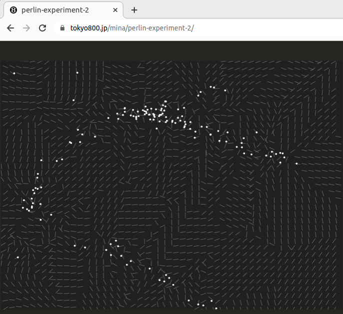

# perlin-experiment-2

Another attempt in using Perlin noise.



[View Demo](https://tokyo800.jp/mina/perlin-experiment-2/)

## 1. About

**(2024.7.31)  
This is outdated. For the better design, check out another project of mine:  
[wasm-canvas-fractals](https://github.com/minagawah/wasm-canvas-fractals/)**

Another attempt in using Perlin noise.

Last time, only the noise calculation was done in WASM,
and canvas animation was done in JS.  
This time, everything is done in WASM.

To better serve as an introductory WASM sample app,
I made the codes as simple as possible.

## 2. Instructions

### Dev + Build

```bash
# DEV
npm run dev
# Check: http://localhost:8080

# BUILD
npm run build
```

## 3. Highlights

Here are major highlights:

1. Spawns a child process for animation,
1. Event listener for browser resize event, and
1. `debounce` to limit executions when resize happens.

### Step 1 - JS

This is where the app starts.  
`App` is provided by WASM. Once ready, we are calling `App.start()`.

```js
// js/index.js
const wasm = await import('../dist/pkg');
const app = new wasm.App({ bgcolor: '#202020', color: '#ffffff' });
app.start();
```

### Step 2 - App.start

**(2024.7.31)  
The design in outdated. I initially used `Rc::new(RefCell::new(Canvas))`  
for storing `canvas` in `Proxy`. Consequently, I had to launch  
a separate process using `spawn_local` so that I could pass args.  
However, this is only needed when exposing data to the scope of `wasm_bindgen`.  
Since these data are not needed to be exposed, we can tell `wasm_bindgen`  
to ignore, and we can call `Canvas` directly without `Rc` nor `RefCell`.  
See `App` in [wasm-canvas-fractals](https://github.com/minagawah/wasm-canvas-fractals/blob/main/src/app.rs) which is another project of mine for examples.**

Calling `App.start()` will essentially be calling `Proxy.run()`.  
As you can see, it is using `wasm_bindgen_futures::spawn_local` to spawn a dedicated child process.  
Why am I not doing it in `App`?  
If we had properties managed in `App`, I would have needed to pass them, and that would be too much of a hussle.

```rust
// src/app.rs

use crate::proxy::Proxy;

#[wasm_bindgen]
pub struct App {
    proxy: Arc<Mutex<Proxy>>,
}

#[wasm_bindgen]
impl App {
    #[wasm_bindgen(constructor)]
    pub fn new(
        params: &JsValue,
    ) -> Result<App, JsValue> {
        Ok(App {
            proxy: Arc::new(Mutex::new(Proxy::new(
                params,
            ))),
        })
    }

    #[wasm_bindgen]
    pub fn start(&mut self) {
        let proxy = Arc::clone(&self.proxy);
        spawn_local(async move {
            let mut proxy = proxy.lock().await;
            proxy.run().await;
            drop(proxy);
        });
    }
}
```

Note:  
Since Rust 1.63.0, [it provides scoped thread](https://blog.rust-lang.org/2022/08/11/Rust-1.63.0.html).
Previously, we had to use `Arc` to move the locally managed variables into the thread.
With the newly introduced `std::thread::scope`, we no longer need the workaround.
However, if I wanted asynchronous tasks in it, there is currently no way to do so.
Hence, still using `wasm_bindgen_futures::spawn_local`.

### Step 3 - Proxy.new

For canvas animations are done mainly in `Canvas`.  
You can see, it is calling `Canvas.regiser_listeners()`.

```rust
// src/proxy.rs

#[derive(Debug, Clone)]
pub struct Proxy {
    pub canvas: Rc<RefCell<Canvas>>,
}

#[allow(clippy::await_holding_refcell_ref)]
impl Proxy {
    pub fn new(params: &JsValue) -> Self {
        let config: Config =
            serde_wasm_bindgen::from_value(
                params.clone(),
            )
            .unwrap();

        let bgcolor: String = config.bgcolor.clone();
        let color: String = config.color;

        let element =
            get_canvas("#perlin-experiment").unwrap();
        let canvas = Rc::new(RefCell::new(
            Canvas::new(element, bgcolor, color),
        ));

        canvas.borrow_mut().register_listeners();
        canvas.borrow_mut().update_size();

        Proxy { canvas }
    }
}
```

### Step 4 - Canvas.register_listeners

When browser size changes, we essentially want to call `Canvas.update_size()`.  
However, we want to debounce the event by 500 msec.

```rust
// src/canvas.rs

impl Canvas {
    //...

    pub fn register_listeners(&mut self) {
        let self_rc =
            Rc::new(RefCell::new(self.clone()));

        let mut debounced_update_size = debounce(
            move || {
                let mut canvas = self_rc.borrow_mut();
                canvas.update_size();
            },
            Duration::from_millis(500),
        );

        let callback =
            Closure::wrap(Box::new(move || {
                debounced_update_size();
            })
                as Box<dyn FnMut()>);

        get_window()
            .expect("No window")
            .set_onresize(Some(
                callback.as_ref().unchecked_ref(),
            ));

        callback.forget();
    }
```

and here is `debounce` function:

```rust
// src/utils.rs

pub fn debounce<F>(
    mut func: F,
    duration: Duration,
) -> impl FnMut()
where
    F: FnMut(),
{
    let mut last_call_time = Instant::now();

    move || {
        let now = Instant::now();
        let elapsed = now
            .duration_since(last_call_time)
            .as_millis() as f64;
        let should_call =
            elapsed >= duration.as_millis() as f64;

        if should_call {
            func();
            last_call_time = now;
        }
    }
}
```

### Step 5 - Proxy.run

Now, looking into `Proxy.run` (called from JS), we are simply using `loop`.  
Notice it is calling `Canvas.update()` and `Canvas.draw()`.

```rust
// src/proxy.rs

impl Proxy {
    //...

    pub async fn run(&mut self) {
        loop {
            timer(REFRESH_RATE).await.unwrap();
            self.canvas.borrow_mut().update();
            self.canvas.borrow_mut().draw();
            request_animation_frame_future().await;
        }
    }
```

### Step 6 - Canvas.update + Canvas.draw

In `update()`, we are using Perlin noise to update particle positions.

```rust
// src/canvas.rs

pub struct Canvas {
    //...
    pub fn update(&mut self) {
        self.frame += 1;
        let mut rng = rand::thread_rng();

        for p in &mut self.particles {
            let w = self.width;
            let h = self.height;

            let noise_val = self.noise.get([
                (p.x / w) + rng.gen_range(-0.1, 0.1),
                (p.y / h) + rng.gen_range(-0.1, 0.1),
                self.frame as f64 / 100.0,
            ]);

            let angle = noise_val * PI * 2.0;
      //...
    }
```

and for `draw()`, we are drawing particles and sticks.

```rust
    pub fn draw(&mut self) {
        //...

        // Sticks
        for i in 0..self.num_of_horizontal_grids {
            let y = i as f64 * self.unit_size;
            for j in 0..self.num_of_vertical_grids {
                let x = j as f64 * self.unit_size;
                //...
            }
        }

        // Particles
        for p in &self.particles {
            //...
        }
    }
```

## 4. Notes

### 4-1. You want to use WASM app in different project

Sometimes:

1. You want to use `wasm-pack` instead of `wasm-pack-plugin`.
1. You want no bundled JS, but import WASM app directly from your HTML page.

Well, that was exactly what I wanted...  
I wanted this Perlin noise sample app running on
[my website](https://www.astralscience.com/),
but instead of hard-wiring the WASM app
into my Webpack project (using `wasm-pack-plugin`),
I wanted to directly build the app using `wasm-pack`
so that binaries were to be emitted into a specified folder.

Here are the solutions:

#### (1) Build with `wasm-pack`

First, take a look at the directory structure:

```
├── client/
|  └── perlin-noise-particles/
|    ├── Cargo.toml
|    └── src/
|      ├── app.rs
|      ├── canvas.rs
|      ├── lib.rs
|      ├── proxy.rs
|      └── utils.rs
|
├── server/
|  ├── public/
|  |  ├── css/
|  |  ├── js/
|  |  ├── wasm/
|  |  |  └── perlin-noise-particles/
|  |  |     └── # ...(binaries)
|  |  |
|  |  └── index.html
|  ├── routes/
|  └── views/
|
└── build_wasm.sh
```

Here I have the source in `client/perlin-noise-particles`.  
I want to build it and emit binaries to `server/public/wasm`.  
To do so, I have a tiny script (called `build_wasm.sh`):

```bash
#!/usr/bin/env bash

APP=${1%\/}
PROFILE=${2:=debug}

ROOT_DIR="$PWD"

SRC_DIR="$ROOT_DIR/client/$APP"
OUT_DIR="$ROOT_DIR/server/public/wasm/$APP"

cd "$SRC_DIR"
wasm-pack build "--$PROFILE" --target web --out-name "$APP" --out-dir "$OUT_DIR"
```

Running it, I get the binaries in desired folder:

```shell
sh ./build_wasm.sh perlin-noise-particles release
```

#### (2) Import from HTML page

Bellow is the original JS file that we have in this sample app, right?
For this, Webpack would bootstrap the WASM app at compile-time.

```js
import('../dist/pkg').catch(console.error);

document.addEventListener('DOMContentLoaded', async () => {
  try {
    const wasm = await import('../dist/pkg');
    const app = new wasm.App({ bgcolor: '#202020', color: '#ffffff' });
    app.start();
  } catch (err) {
    console.error(err);
  }
});
```

Instead, we want to look up the WASM app at _runtime_.  
So, here's what I have:

```html
<html>
  <body>
    <canvas id="perlin-noise-particles"></canvas>

    <script type="module">
      import init, {
        App,
      } from './wasm/perlin-noise-particles/perlin-noise-particles.js';

      import('./wasm/perlin-noise-particles/perlin-noise-particles.js').catch(
        console.error
      );

      document.addEventListener('DOMContentLoaded', async () => {
        try {
          await init();

          const app = new App({ bgcolor: '#000084', color: '#ffffff' });
          app.start();
        } catch (err) {
          console.error(err);
        }
      });
    </script>
  </body>
</html>
```

Notice that I use `<script type="module">` so that the browser
would understand the `import` syntax.

### 4-2. cargo fmt

Looking into [rustfmt.toml](rustfmt.toml),
you see the setting:

```toml
format_strings = true
```

which works only for the Nightly build.  
So, you need:

```bash
cargo +nightly fmt
```

## 5. What I did

### Rust + wasm-pack

Installed Rust + wasm-pack.  
See [Cargo.toml](Cargo.toml) for installed packages.

### NPM Packages

#### Babel

- core-js
- @babel/cli
- @babel/core
- @babel/preset-env
- babel-loader

#### Webpack & Loaders

- webpack
- webpack-cli
- webpack-dev-server
- file-loader
- css-loader
- postcss-loader
- style-loader
- clean-webpack-plugin
- html-webpack-plugin
- autoprefixer

#### wasm-pack

- @wasm-tool/wasm-pack-plugin

#### Others

- postcss-cli
- postcss-preset-env
- postcss-import
- postcss-mixins
- tailwindcss
- nodemon
- concurrently
- rimraf
- prettier

#### All NPM Packages

```bash
npm install --save core-js

npm install --save-dev @babel/cli @babel/core @babel/preset-env \
  babel-loader webpack webpack-cli webpack-dev-server \
  file-loader css-loader postcss-loader style-loader \
  clean-webpack-plugin html-webpack-plugin \
  autoprefixer postcss-cli postcss-preset-env \
  postcss-import postcss-mixins \
  nodemon concurrently rimraf prettier \
  @wasm-tool/wasm-pack-plugin
```

## 6. License

Dual-licensed under MIT or the [UNLICENSE](https://unlicense.org/).  
Choose at your option.

For external crates in use:

```shell
$ cargo license

(MIT OR Apache-2.0) AND Unicode-DFS-2016 (1): unicode-ident
0BSD OR Apache-2.0 OR MIT (1): adler
Apache-2.0 (1): codespan-reporting
Apache-2.0 OR Apache-2.0 WITH LLVM-exception OR MIT (2): wasi, wasi
Apache-2.0 OR BSL-1.0 (1): ryu
Apache-2.0 OR MIT (124): android_system_properties, async-attributes, async-channel, async-executor, async-global-executor, async-io, async-lock, async-std, async-task, atomic-waker, autocfg, bitflags, blocking, bumpalo, callback-future, cc, cfg-if, chrono, concurrent-queue, console_error_panic_hook, console_log, core-foundation-sys, crc32fast, crossbeam-channel, crossbeam-deque, crossbeam-epoch, crossbeam-utils, ctor, cxx, cxx-build, cxxbridge-flags, cxxbridge-macro, deflate, either, event-listener, fastrand, futures, futures-channel, futures-core, futures-executor, futures-io, futures-lite, futures-macro, futures-sink, futures-task, futures-util, getrandom, gif, gloo-timers, hermit-abi, hex, iana-time-zone, iana-time-zone-haiku, itoa, jpeg-decoder, js-sys, kv-log-macro, libc, link-cplusplus, lock_api, log, noise, num, num-bigint, num-complex, num-integer, num-iter, num-rational, num-rational, num-traits, num_cpus, once_cell, parking, parking_lot, parking_lot_core, pin-project-lite, pin-utils, png, polling, ppv-lite86, proc-macro2, quote, rand, rand_chacha, rand_core, rand_hc, rand_xorshift, rayon, rayon-core, scopeguard, scratch, serde, serde_derive, serde_json, smallvec, socket2, syn, syn, time, unicode-width, value-bag, version_check, waker-fn, wasm-bindgen, wasm-bindgen-backend, wasm-bindgen-futures, wasm-bindgen-macro, wasm-bindgen-macro-support, wasm-bindgen-shared, web-sys, weezl, winapi, winapi-i686-pc-windows-gnu, winapi-x86_64-pc-windows-gnu, windows-sys, windows-sys, windows-targets, windows_aarch64_gnullvm, windows_aarch64_msvc, windows_i686_gnu, windows_i686_msvc, windows_x86_64_gnu, windows_x86_64_gnullvm, windows_x86_64_msvc
Apache-2.0 OR MIT OR Zlib (2): bytemuck, miniz_oxide
BSD-3-Clause (1): instant
MIT (12): color_quant, image, lerp, memoffset, miniz_oxide, redox_syscall, scoped_threadpool, serde-wasm-bindgen, slab, tiff, tokio, wasm-timer
MIT OR Unlicense (4): byteorder, memchr, termcolor, winapi-util
Unlicense or MIT (1): perlin-experiment-2
Zlib (1): adler32
```
